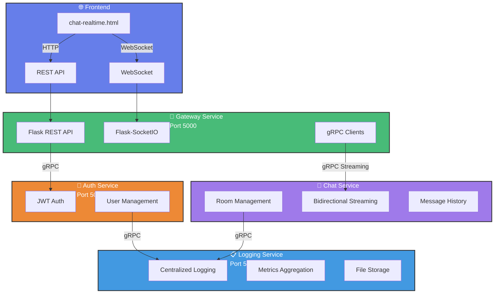
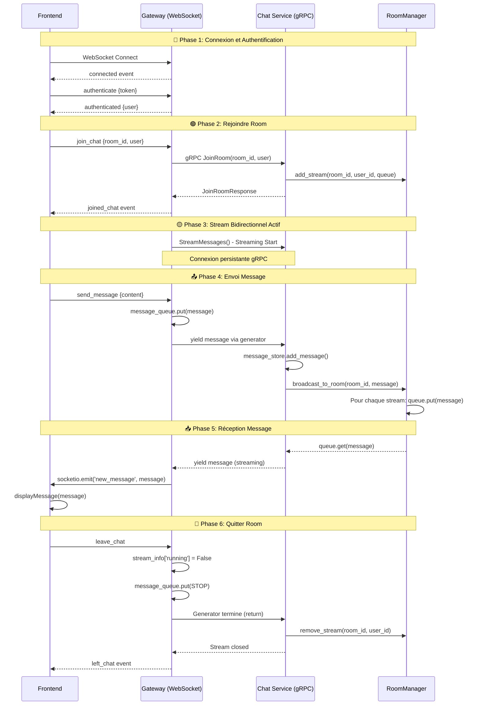

# 📚 TP : Système de Chat Temps Réel avec Architecture Microservices

## 🎯 Objectifs Pédagogiques

À la fin de ce TP, vous serez capable de :
- Concevoir et implémenter une architecture microservices avec gRPC
- Gérer des communications bidirectionnelles en temps réel (WebSocket + gRPC streaming)
- Résoudre les problèmes d'incompatibilité entre threading et async_mode
- Mettre en place un système de logging centralisé
- Déployer une application multi-services avec Docker Compose
- Implémenter un système d'authentification JWT
- Gérer des rooms de chat avec broadcast de messages

## 📋 Vue d'Ensemble du Projet

**Système** : Application de chat en temps réel multi-utilisateurs avec rooms

**Architecture** : Microservices avec communication gRPC et WebSocket

**Technologies** :
- Backend : Python (Flask, gRPC, Flask-SocketIO)
- Frontend : HTML/CSS/JavaScript (Vanilla)
- Communication : gRPC (streaming bidirectionnel), WebSocket
- Conteneurisation : Docker, Docker Compose
- Protocoles : Protocol Buffers (protobuf)

---

## 🏗️ Architecture du Système

### Diagramme d'Architecture



### Services et Responsabilités

#### **Gateway Service** (Port 5000)
- Point d'entrée unique pour le frontend
- Gestion des WebSocket pour le temps réel
- Proxy REST vers les autres services
- Communication gRPC avec Auth et Chat services
- **⚠️ IMPORTANT : Utilise `async_mode='threading'` pour Flask-SocketIO**

#### **Auth Service** (Port 5001)
- Authentification des utilisateurs
- Génération et validation de tokens JWT
- Gestion des utilisateurs (création, login)
- API REST pour le Gateway

#### **Chat Service** (Port 50052 - gRPC)
- Gestion des rooms de chat
- Streaming bidirectionnel gRPC pour les messages
- Broadcast des messages via RoomManager
- Historique des messages
- Gestion des membres des rooms

#### **Logging Service** (Port 50053 - gRPC)
- Centralisation des logs de tous les services
- Stockage des logs dans des fichiers journaliers
- Agrégation de métriques
- API gRPC pour logging structuré

---

## 📦 Structure du Projet

```
tp-protocol-buffers-et-serialisation/
├── docker-compose.yml
├── README.md
├── proto/
│   ├── common.proto
│   ├── auth.proto
│   ├── chat.proto
│   └── logging.proto
├── gateway-service/
│   ├── Dockerfile
│   ├── requirements.txt
│   ├── .env
│   ├── proto/
│   └── src/
│       ├── app.py
│       ├── config.py
│       ├── websocket_handler.py
│       └── clients/
├── auth-service/
│   ├── Dockerfile
│   ├── requirements.txt
│   ├── .env
│   ├── proto/
│   └── src/
│       ├── app.py
│       ├── config.py
│       └── models/
├── chat-service/
│   ├── Dockerfile
│   ├── requirements.txt
│   ├── .env
│   ├── proto/
│   └── src/
│       ├── server.py
│       ├── config.py
│       ├── services/
│       │   └── chat_service.py
│       └── utils/
│           └── room_manager.py
├── logging-service/
│   ├── Dockerfile
│   ├── requirements.txt
│   ├── .env
│   ├── proto/
│   ├── logs/
│   └── src/
│       ├── server.py
│       └── services/
└── frontend/
    └── chat-realtime.html
```

---

## 🚀 Installation et Démarrage

### Prérequis

- Docker et Docker Compose installés
- Ports disponibles : 5000, 5001, 50052, 50053

### Démarrage

```bash
# Cloner le projet
git clone <votre-repo>
cd tp-protocol-buffers-et-serialisation

# Générer les fichiers proto (si nécessaire)
# Voir section "Génération des fichiers Proto"

# Démarrer tous les services
docker-compose up --build

# Ou en mode détaché
docker-compose up -d --build
```

### Vérification

```bash
# Voir les logs
docker-compose logs -f

# Vérifier que tous les services sont UP
docker-compose ps

# Devrait afficher :
# flask-gateway    running   0.0.0.0:5000->5000/tcp
# flask-auth       running   0.0.0.0:5001->5001/tcp
# grpc-chat        running   0.0.0.0:50052->50052/tcp
# grpc-logging     running   0.0.0.0:50053->50053/tcp
```

### Accès à l'Application

1. Ouvrir le navigateur : `http://localhost:5000/chat-realtime.html`
2. Se connecter avec les credentials par défaut :
   - **Username** : `admin`
   - **Password** : `admin123`

   Autres utilisateurs disponibles :
   - `user1` / `password1`
   - `user2` / `password2`

---

## 🔧 Configuration

### Variables d'Environnement

#### Gateway Service (`.env`)
```env
FLASK_PORT=5000
AUTH_SERVICE_URL=http://auth-service:5001
CHAT_SERVICE_HOST=chat-service
CHAT_SERVICE_PORT=50052
CHAT_API_KEY=chat-service-api-key-456
JWT_SECRET=your-super-secret-jwt-key-change-in-production
SECRET_KEY=gateway-secret-key-change-me
```

#### Auth Service (`.env`)
```env
FLASK_PORT=5001
JWT_SECRET=your-super-secret-jwt-key-change-in-production
JWT_EXPIRATION=3600
SECRET_KEY=auth-secret-key-change-me
LOGGING_SERVICE_HOST=logging-service
LOGGING_SERVICE_PORT=50053
LOGGING_API_KEY=logging-service-api-key-123
```

#### Chat Service (`.env`)
```env
SERVICE_PORT=50052
API_KEY=chat-service-api-key-456
LOGGING_SERVICE_HOST=logging-service
LOGGING_SERVICE_PORT=50053
LOGGING_API_KEY=logging-service-api-key-123
MAX_ROOM_MEMBERS=100
MAX_MESSAGE_LENGTH=1000
MESSAGE_HISTORY_LIMIT=100
```

#### Logging Service (`.env`)
```env
SERVICE_PORT=50053
API_KEY=logging-service-api-key-123
LOG_DIRECTORY=/app/logs
LOG_LEVEL=INFO
```

---

## 🛠️ Fonctionnalités

### Authentification
- ✅ Login avec JWT
- ✅ Validation de token
- ✅ Session persistante

### Gestion des Rooms
- ✅ Créer une room
- ✅ Lister les rooms disponibles
- ✅ Voir le nombre de membres
- ✅ Rejoindre/Quitter une room

### Chat Temps Réel
- ✅ Envoi de messages instantané
- ✅ Réception temps réel (WebSocket + gRPC streaming)
- ✅ Broadcast à tous les membres de la room
- ✅ Messages système (JOIN/LEAVE)
- ✅ Historique des messages
- ✅ Auto-scroll
- ✅ Distinction messages propres/autres utilisateurs

### Logging
- ✅ Logs centralisés de tous les services
- ✅ Stockage dans fichiers journaliers
- ✅ Format JSON structuré

---

## ⚠️ PROBLÈMES RÉSOLUS - À CONNAÎTRE ABSOLUMENT

### 1. ❌ PROBLÈME : `socketio.emit()` ne fonctionne pas depuis un thread

**Symptôme** : Les messages sont émis côté serveur (logs visibles) mais ne sont jamais reçus par le frontend.

**Cause** : Incompatibilité entre `async_mode='eventlet'` et `threading.Thread`

**✅ SOLUTION** : Utiliser `async_mode='threading'` dans Flask-SocketIO

```python
# ❌ NE FONCTIONNE PAS
socketio = SocketIO(app, cors_allowed_origins="*", async_mode='eventlet')
thread = threading.Thread(target=receive_messages, daemon=True)

# ✅ SOLUTION
socketio = SocketIO(app, cors_allowed_origins="*", async_mode='threading')
thread = threading.Thread(target=receive_messages, daemon=True)
```

**Fichier** : `gateway-service/src/websocket_handler.py`

```python
def init_socketio(app):
    global socketio, chat_stub, metadata
    
    # ✅ CRUCIAL : async_mode='threading'
    socketio = SocketIO(app, cors_allowed_origins="*", async_mode='threading')
    
    # ... reste du code
```

**Fichier** : `gateway-service/src/app.py`

```python
def run():
    socketio.run(
        app, 
        host='0.0.0.0', 
        port=config.FLASK_PORT, 
        debug=False,  # ✅ debug=False en production
        use_reloader=False,  # ✅ Important pour éviter double démarrage
        allow_unsafe_werkzeug=True  # ✅ Pour développement uniquement
    )
```

### 2. ❌ PROBLÈME : Messages dupliqués

**Symptôme** : Chaque message apparaît 2 fois dans le frontend

**Cause** : Double inscription à la room (REST + WebSocket)

**✅ SOLUTION** : Utiliser UNIQUEMENT le WebSocket pour rejoindre

```javascript
// ❌ NE PAS FAIRE
await fetch(`http://localhost:5000/api/rooms/${room.id}/join`, { ... });  // REST
socket.emit('join_chat', { ... });  // WebSocket

// ✅ FAIRE
socket.emit('join_chat', {  // WebSocket UNIQUEMENT
    room_id: room.id,
    user: currentUser
});
```

### 3. ❌ PROBLÈME : Scrollbar n'apparaît pas dans le chat

**Symptôme** : Impossible de scroller quand il y a beaucoup de messages

**Cause** : CSS flex mal configuré, le conteneur `.messages` prend toute la hauteur nécessaire au lieu d'être limité

**✅ SOLUTION** : Forcer le flex container avec `min-height: 0`

```css
/* ✅ Configuration correcte */
#chat-screen {
    display: flex !important;
    flex-direction: column;
    height: 100%;
}

.header {
    flex-shrink: 0;  /* Ne rétrécit pas */
}

.messages {
    flex: 1;
    overflow-y: scroll;
    overflow-x: hidden;
    min-height: 0;  /* ✅ CRUCIAL pour que overflow fonctionne */
}

.input-area {
    flex-shrink: 0;  /* Ne rétrécit pas */
}
```

### 4. ❌ PROBLÈME : Logs Python ne s'affichent pas dans Docker

**Symptôme** : `print()` ne s'affiche pas dans `docker logs`

**Cause** : Output Python bufferisé par défaut

**✅ SOLUTION** : Ajouter `PYTHONUNBUFFERED=1` dans Dockerfile

```dockerfile
ENV PYTHONUNBUFFERED=1
```

### 5. ❌ PROBLÈME : Stream gRPC ne se ferme pas proprement

**Symptôme** : Impossible de rejoindre une room après l'avoir quittée

**Cause** : Le générateur de messages ne se termine pas, le `finally` n'est jamais exécuté

**✅ SOLUTION** : Envoyer un signal STOP et utiliser `return` dans le générateur

```python
STOP = object()  # Sentinel value

def message_generator():
    # Message JOIN initial
    yield chat_pb2.ChatMessage(type=chat_pb2.JOIN, ...)
    
    while stream_info['running']:
        try:
            message = message_queue.get(timeout=0.5)
            if message is STOP:
                print(f"⚠️ STOP reçu, arrêt du générateur")
                return  # ✅ Ferme le stream gRPC
            yield message
        except Empty:
            continue

# Quand l'utilisateur quitte
stream_info['running'] = False
stream_info['message_queue'].put(STOP)  # ✅ Signal d'arrêt
```

---

## 📡 Flux de Données

### Diagramme de Séquence Complet



---

## 🧪 Tests Fonctionnels

### Scénario 1 : Chat Multi-Utilisateurs

1. **Ouvrir 2 navigateurs** (ou 2 onglets en navigation privée)
2. **Navigateur A** : Se connecter avec `admin` / `admin123`
3. **Navigateur B** : Se connecter avec `user1` / `password1`
4. **Les deux** : Créer ou rejoindre la même room
5. **Navigateur A** : Envoyer "Hello from admin"
6. **Vérifier** : Le message apparaît instantanément dans les 2 navigateurs
7. **Navigateur B** : Répondre "Hello from user1"
8. **Vérifier** : Le message apparaît dans les 2 navigateurs

✅ **Résultat attendu** : Messages temps réel bidirectionnels, pas de duplication

### Scénario 2 : Historique

1. Se connecter et rejoindre une room
2. Envoyer plusieurs messages
3. Quitter la room (bouton "Quitter")
4. Rejoindre la même room
5. **Vérifier** : Les messages précédents sont affichés (historique)

### Scénario 3 : Messages Système

1. **Utilisateur A** : Rejoindre une room
2. **Vérifier** : Message système "admin a rejoint la room"
3. **Utilisateur B** : Rejoindre la même room
4. **Vérifier** : Les 2 utilisateurs voient "user1 a rejoint la room"
5. **Utilisateur B** : Quitter
6. **Vérifier** : "user1 a quitté la room"

---

## 🔍 Débogage

### Voir les logs en temps réel

```bash
# Tous les services
docker-compose logs -f

# Service spécifique
docker-compose logs -f gateway
docker-compose logs -f chat-service

# Logs du chat service (gRPC)
docker logs -f grpc-chat

# Logs de logging centralisés
cat logging-service/logs/chat-service_2026-01-04.log
```

### Vérifier la santé des services

```bash
# Gateway
curl http://localhost:5000/health

# Auth
curl http://localhost:5001/health
```

### Redémarrer un service

```bash
docker-compose restart gateway
docker-compose restart chat-service
```

### Nettoyer et reconstruire

```bash
docker-compose down
docker-compose up --build
```

---

## 📚 Génération des Fichiers Proto

### Installation de grpcio-tools

```bash
pip install grpcio-tools
```

### Générer pour chaque service

```bash
# Depuis le dossier racine
cd proto

# Pour gateway-service
python -m grpc_tools.protoc -I. --python_out=../gateway-service/proto --grpc_python_out=../gateway-service/proto common.proto auth.proto chat.proto

# Pour chat-service
python -m grpc_tools.protoc -I. --python_out=../chat-service/proto --grpc_python_out=../chat-service/proto common.proto chat.proto logging.proto

# Pour auth-service
python -m grpc_tools.protoc -I. --python_out=../auth-service/proto --grpc_python_out=../auth-service/proto common.proto auth.proto logging.proto

# Pour logging-service
python -m grpc_tools.protoc -I. --python_out=../logging-service/proto --grpc_python_out=../logging-service/proto common.proto logging.proto
```

---

## 🎓 Points Techniques Clés

### 1. RoomManager - Broadcast Pattern

Le `RoomManager` est au cœur du système de broadcast. Il maintient une map de toutes les connexions actives :

```python
class RoomManager:
    def __init__(self):
        # {room_id: {user_id: queue}}
        self.active_streams = {}
    
    def add_stream(self, room_id, user_id, message_queue):
        """Enregistrer un stream pour broadcast"""
        if room_id not in self.active_streams:
            self.active_streams[room_id] = {}
        self.active_streams[room_id][user_id] = message_queue
    
    def broadcast_to_room(self, room_id, message):
        """Envoyer à TOUS les streams de la room"""
        if room_id not in self.active_streams:
            return
        
        for user_id, queue in self.active_streams[room_id].items():
            queue.put(message)
```

### 2. Streaming Bidirectionnel gRPC

```python
def StreamMessages(self, request_iterator, context):
    """
    request_iterator : messages du client vers serveur
    yield : messages du serveur vers client
    """
    message_queue = queue.Queue()
    
    # Thread pour lire les messages clients
    def read_client_messages():
        for msg in request_iterator:
            if msg.type == JOIN:
                # Enregistrer le stream
                self.room_manager.add_stream(
                    msg.room_id, 
                    msg.user_id, 
                    message_queue
                )
            elif msg.type == TEXT:
                # Sauvegarder et broadcaster
                self.message_store.add_message(msg)
                self.room_manager.broadcast_to_room(msg.room_id, msg)
    
    # Thread pour envoyer les messages au client
    while True:
        msg = message_queue.get()
        yield msg
```

### 3. WebSocket Handler avec Threading

```python
def start_grpc_stream(session_id, room_id, user_info):
    message_queue = Queue()
    
    def message_generator():
        # Message JOIN
        yield ChatMessage(type=JOIN, ...)
        
        # Messages de l'utilisateur
        while stream_info['running']:
            msg = message_queue.get(timeout=0.5)
            if msg is STOP:
                return
            yield msg
    
    def receive_messages():
        # Recevoir du serveur gRPC
        for message in chat_stub.StreamMessages(message_generator()):
            # ✅ Émettre via SocketIO (fonctionne avec threading mode)
            socketio.emit('new_message', message_data, room=room_id)
    
    # ✅ Threading standard (car async_mode='threading')
    thread = threading.Thread(target=receive_messages, daemon=True)
    thread.start()
```

---

## 🚀 Améliorations Possibles

### Court Terme
- [ ] Ajouter une base de données (PostgreSQL)
- [ ] Persister les utilisateurs et rooms
- [ ] Ajouter la validation des inputs
- [ ] Améliorer la gestion d'erreurs

### Moyen Terme
- [ ] Upload de fichiers/images
- [ ] Messages privés (DM)
- [ ] Notifications push
- [ ] Typing indicator
- [ ] Read receipts

### Long Terme
- [ ] Système de permissions (admin/user)
- [ ] Modération de contenu
- [ ] Recherche dans l'historique
- [ ] Export de conversations
- [ ] Analytics et métriques

---

## 📖 Ressources

- [gRPC Python Documentation](https://grpc.io/docs/languages/python/)
- [Flask-SocketIO Documentation](https://flask-socketio.readthedocs.io/)
- [Protocol Buffers Guide](https://developers.google.com/protocol-buffers)
- [Docker Compose Documentation](https://docs.docker.com/compose/)

---

## 🤝 Contribution

Pour contribuer :
1. Fork le projet
2. Créer une branche (`git checkout -b feature/AmazingFeature`)
3. Commit (`git commit -m 'Add AmazingFeature'`)
4. Push (`git push origin feature/AmazingFeature`)
5. Ouvrir une Pull Request

---

## 📝 Licence

Ce projet est à usage éducatif uniquement.

---

## 👨‍💻 Auteur

Créé dans le cadre du TP sur Protocol Buffers et Architecture Microservices

---

**⚡ Bon développement !**