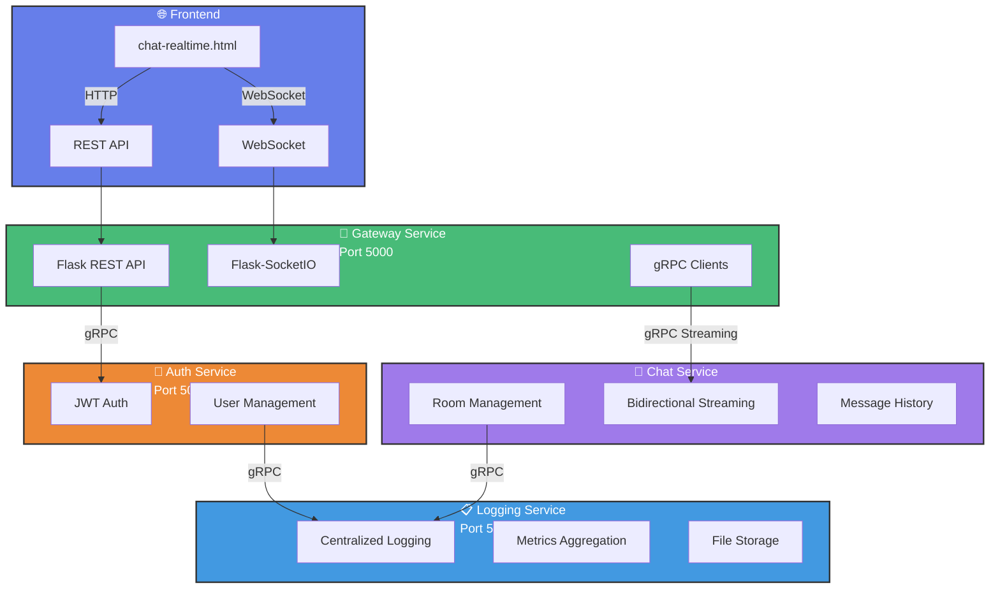
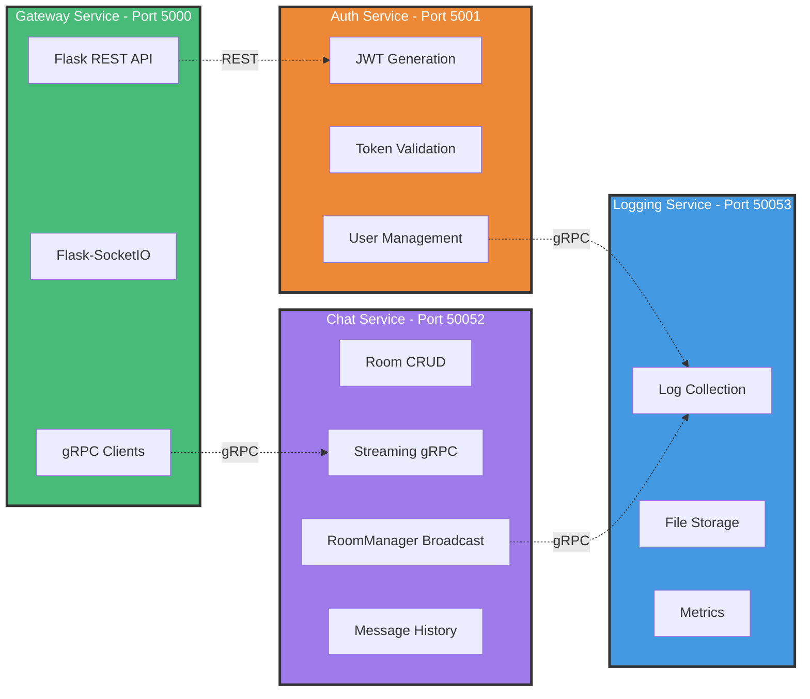
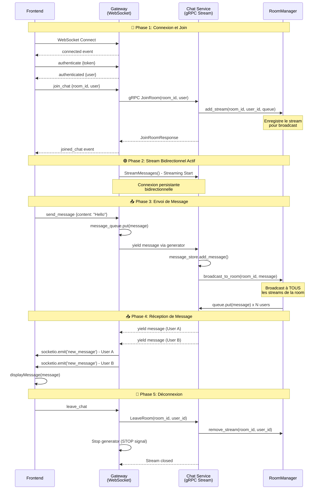
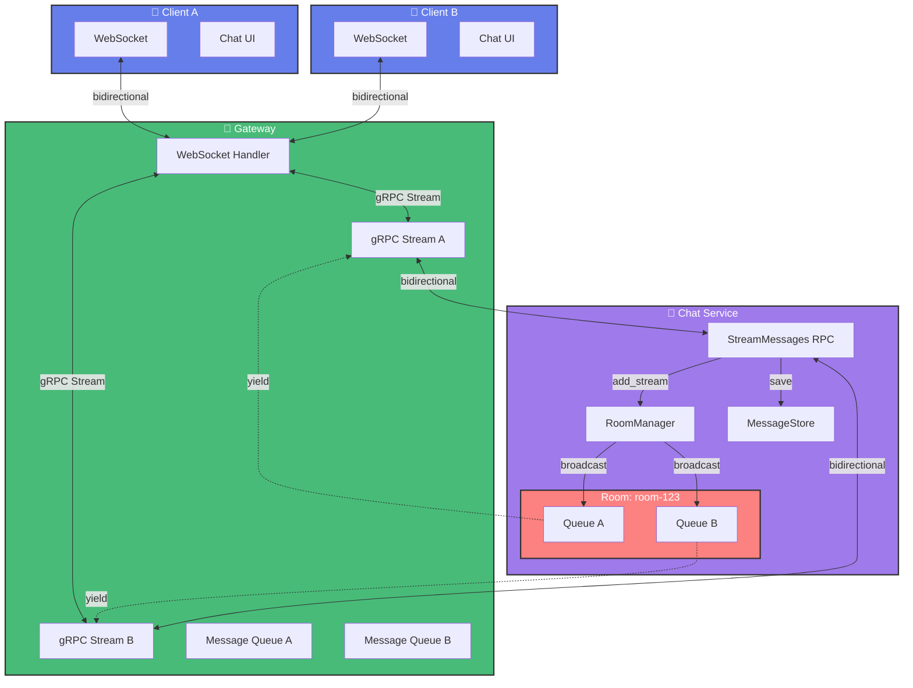
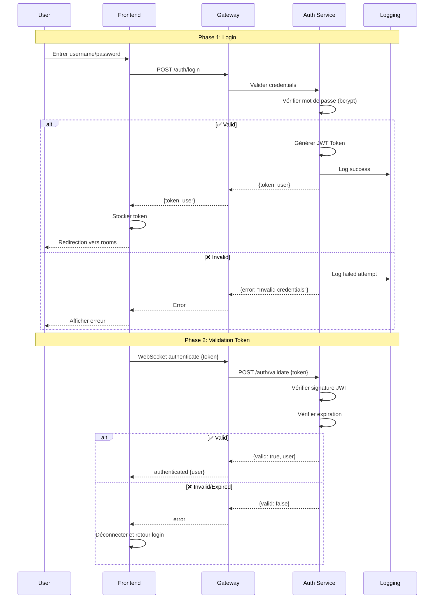
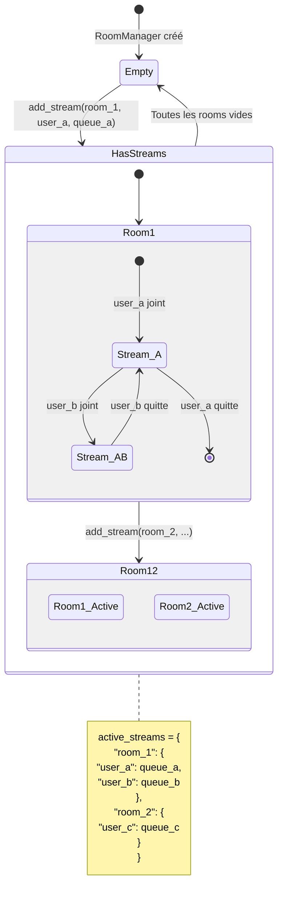
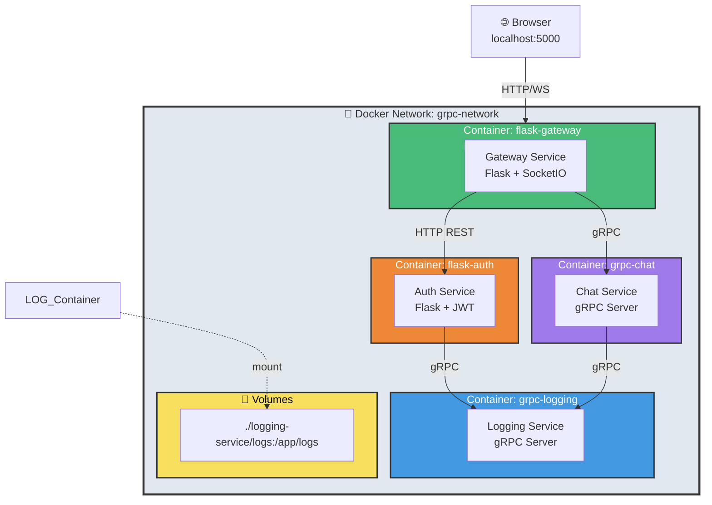
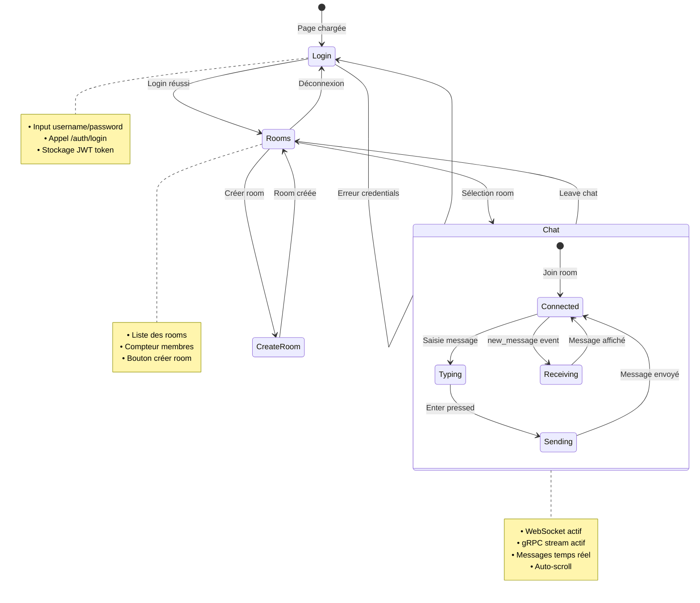

# 📚 TP : Système de Chat Temps Réel avec Architecture Microservices

## 🎯 Objectifs Pédagogiques

À la fin de ce TP, vous serez capable de :
- Concevoir et implémenter une architecture microservices avec gRPC
- Gérer des communications bidirectionnelles en temps réel (WebSocket + gRPC streaming)
- Mettre en place un système de logging centralisé
- Déployer une application multi-services avec Docker Compose
- Implémenter un système d'authentification JWT
- Gérer des rooms de chat avec broadcast de messages

## 📋 Cahier des Charges

### 1. Vue d'Ensemble du Projet

**Système** : Application de chat en temps réel multi-utilisateurs avec rooms

**Architecture** : Microservices avec communication gRPC et WebSocket

**Technologies** :
- Backend : Python (Flask, gRPC, Flask-SocketIO)
- Frontend : HTML/CSS/JavaScript (Vanilla)
- Communication : gRPC (streaming bidirectionnel), WebSocket
- Conteneurisation : Docker, Docker Compose
- Protocoles : Protocol Buffers (protobuf)

---

## 🏗️ Architecture du Système

### 1.1 Diagramme d'Architecture



### 1.2 Services et Responsabilités



### 1.3 Flux de Messages en Temps Réel



### 1.4 Architecture WebSocket + gRPC Streaming



#### **Gateway Service** (Port 5000)
- Point d'entrée unique pour le frontend
- Gestion des WebSocket pour le temps réel
- Proxy REST vers les autres services
- Communication gRPC avec Auth et Chat services

#### **Auth Service** (Port 5001)
- Authentification des utilisateurs
- Génération et validation de tokens JWT
- Gestion des utilisateurs (création, login)
- API REST pour le Gateway

#### **Chat Service** (Port 50052 - gRPC)
- Gestion des rooms de chat
- Streaming bidirectionnel gRPC pour les messages
- Broadcast des messages via RoomManager
- Historique des messages
- Gestion des membres des rooms

#### **Logging Service** (Port 50053 - gRPC)
- Centralisation des logs de tous les services
- Stockage des logs dans des fichiers journaliers
- Agrégation de métriques
- API gRPC pour logging structuré

---

## 📦 Spécifications Techniques Détaillées

### 2. Proto Definitions (Protocol Buffers)

#### 2.1 `common.proto`
```protobuf
syntax = "proto3";

package common;

message Status {
    bool success = 1;
    string message = 2;
    int32 code = 3;
}

message Empty {}
```

#### 2.2 `auth.proto`
```protobuf
syntax = "proto3";

package auth;

import "common.proto";

message User {
    string user_id = 1;
    string username = 2;
    string email = 3;
    int64 created_at = 4;
}

message LoginRequest {
    string username = 1;
    string password = 2;
}

message LoginResponse {
    bool success = 1;
    string token = 2;
    User user = 3;
    string message = 4;
}

message ValidateTokenRequest {
    string token = 1;
}

message ValidateTokenResponse {
    bool valid = 1;
    User user = 2;
}
```

#### 2.3 `chat.proto`
```protobuf
syntax = "proto3";

package chat;

import "common.proto";

enum MessageType {
    TEXT = 0;
    SYSTEM = 1;
    JOIN = 2;
    LEAVE = 3;
}

message Room {
    string id = 1;
    string name = 2;
    string description = 3;
    string created_by = 4;
    int64 created_at = 5;
    int32 member_count = 6;
}

message ChatMessage {
    string id = 1;
    string room_id = 2;
    string user_id = 3;
    string username = 4;
    string content = 5;
    int64 timestamp = 6;
    MessageType type = 7;
}

message CreateRoomRequest {
    string name = 1;
    string description = 2;
    string created_by = 3;
}

message ListRoomsRequest {}

message ListRoomsResponse {
    repeated Room rooms = 1;
    int32 total = 2;
}

message JoinRoomRequest {
    string room_id = 1;
    string user_id = 2;
    string username = 3;
}

message JoinRoomResponse {
    bool success = 1;
    string message = 2;
    Room room = 3;
}

message LeaveRoomRequest {
    string room_id = 1;
    string user_id = 2;
}

message GetRoomHistoryRequest {
    string room_id = 1;
    int32 limit = 2;
}

message RoomMember {
    string user_id = 1;
    string username = 2;
    int64 joined_at = 3;
}

message RoomMembersResponse {
    repeated RoomMember members = 1;
}

service ChatService {
    rpc CreateRoom(CreateRoomRequest) returns (Room);
    rpc ListRooms(ListRoomsRequest) returns (ListRoomsResponse);
    rpc JoinRoom(JoinRoomRequest) returns (JoinRoomResponse);
    rpc LeaveRoom(LeaveRoomRequest) returns (common.Status);
    
    // Streaming bidirectionnel pour les messages temps réel
    rpc StreamMessages(stream ChatMessage) returns (stream ChatMessage);
    
    // Récupérer l'historique (streaming serveur)
    rpc GetRoomHistory(GetRoomHistoryRequest) returns (stream ChatMessage);
    
    rpc GetRoomMembers(GetRoomHistoryRequest) returns (RoomMembersResponse);
}
```

#### 2.4 `logging.proto`
```protobuf
syntax = "proto3";

package logging;

import "common.proto";

enum LogLevel {
    DEBUG = 0;
    INFO = 1;
    WARNING = 2;
    ERROR = 3;
    CRITICAL = 4;
}

message LogEntry {
    string service = 1;
    LogLevel level = 2;
    string message = 3;
    int64 timestamp = 4;
    map<string, string> metadata = 5;
    string trace_id = 6;
}

message LogRequest {
    LogEntry entry = 1;
}

message LogResponse {
    bool success = 1;
}

service LoggingService {
    rpc Log(LogRequest) returns (LogResponse);
}
```

---

## 🛠️ Implémentation par Service

### 3. Auth Service

#### 3.1 Structure des Fichiers
```
auth-service/
├── Dockerfile
├── requirements.txt
├── .env
├── proto/
│   ├── auth_pb2.py
│   ├── auth_pb2_grpc.py
│   ├── common_pb2.py
│   └── logging_pb2.py
└── src/
    ├── app.py                 # Application Flask principale
    ├── config.py              # Configuration
    ├── models/
    │   └── user.py            # Modèle User en mémoire
    ├── utils/
    │   └── jwt_helper.py      # Fonctions JWT
    └── clients/
        └── logging_client.py  # Client gRPC vers Logging
```

#### 3.2 Fonctionnalités Requises

**Flux d'Authentification** :



**Endpoints REST** :
- `POST /auth/register` : Créer un utilisateur
- `POST /auth/login` : Se connecter et obtenir un JWT
- `POST /auth/validate` : Valider un token JWT

**Stockage** :
- Utilisateurs stockés en mémoire (dictionnaire Python)
- Mots de passe hashés avec bcrypt
- Tokens JWT avec expiration (1h par défaut)

**Users par défaut** :
```python
{
    "admin": {"password": "admin123", "email": "admin@test.com"},
    "user1": {"password": "password1", "email": "user1@test.com"},
    "user2": {"password": "password2", "email": "user2@test.com"}
}
```

#### 3.3 Configuration (`.env`)
```env
FLASK_PORT=5001
JWT_SECRET=your-super-secret-jwt-key-change-in-production
JWT_EXPIRATION=3600
LOGGING_SERVICE_HOST=logging-service
LOGGING_SERVICE_PORT=50053
LOGGING_API_KEY=logging-service-api-key-123
```

---

### 4. Chat Service

#### 4.1 Structure des Fichiers
```
chat-service/
├── Dockerfile
├── requirements.txt
├── .env
├── proto/
│   ├── chat_pb2.py
│   ├── chat_pb2_grpc.py
│   ├── common_pb2.py
│   └── logging_pb2.py
└── src/
    ├── server.py              # Serveur gRPC
    ├── config.py
    ├── models/
    │   ├── room.py            # Modèle Room
    │   └── message.py         # Modèle Message
    ├── services/
    │   └── chat_service.py    # Implémentation ChatService
    ├── utils/
    │   └── room_manager.py    # Gestion du broadcast
    ├── clients/
    │   └── logging_client.py
    └── interceptors/
        └── api_key_interceptor.py  # Sécurité gRPC
```

#### 4.2 Fonctionnalités Requises

**gRPC Methods** :
- `CreateRoom` : Créer une room de chat
- `ListRooms` : Lister toutes les rooms
- `JoinRoom` : Rejoindre une room
- `LeaveRoom` : Quitter une room
- `StreamMessages` : **Streaming bidirectionnel** pour messages temps réel
- `GetRoomHistory` : Récupérer historique (streaming serveur)
- `GetRoomMembers` : Liste des membres d'une room

**RoomManager** (CRITIQUE) :
```python
class RoomManager:
    def __init__(self):
        self.active_streams = {}  # {room_id: {user_id: queue}}
    
    def add_stream(self, room_id, user_id, message_queue):
        """Enregistrer un stream pour recevoir les messages"""
        
    def remove_stream(self, room_id, user_id):
        """Retirer un stream"""
        
    def broadcast_to_room(self, room_id, message):
        """Envoyer un message à tous les streams de la room"""
        for user_id, queue in self.active_streams[room_id].items():
            queue.put(message)
```

**Diagramme d'État du RoomManager** :



**Flux de Broadcast** :

```mermaid
flowchart TB
    Start([Message reçu]) --> Check{room_id exists<br/>in active_streams?}
    
    Check -->|Non| Error[⚠️ Room non trouvée<br/>Broadcast échoue]
    Check -->|Oui| GetStreams[Récupérer tous les streams<br/>de la room]
    
    GetStreams --> Loop{Pour chaque<br/>user_id, queue}
    
    Loop -->|Parcourir| Put[queue.put(message)]
    Put --> Loop
    
    Loop -->|Terminé| Success[✅ Message broadcasté<br/>à N utilisateurs]
    
    Error --> End([Fin])
    Success --> End
    
    style Start fill:#48bb78,stroke:#333,color:#fff
    style Check fill:#4299e1,stroke:#333,color:#fff
    style Error fill:#fc8181,stroke:#333,color:#fff
    style Success fill:#68d391,stroke:#333,color:#fff
    style End fill:#a0aec0,stroke:#333,color:#fff
```

**StreamMessages - Implémentation** :
```python
def StreamMessages(self, request_iterator, context):
    message_queue = queue.Queue()
    room_id = user_id = username = None
    stream_registered = False

    def read_client_messages():
        nonlocal room_id, user_id, username, stream_registered
        for msg in request_iterator:
            if msg.type == JOIN:
                room_id = msg.room_id
                user_id = msg.user_id
                username = msg.username
                # CRITIQUE : Enregistrer IMMÉDIATEMENT
                self.room_manager.add_stream(room_id, user_id, message_queue)
                stream_registered = True
            
            elif msg.type == TEXT:
                if not stream_registered:
                    continue
                # Sauvegarder en base
                saved_message = self.message_store.add_message(...)
                # Broadcaster
                self.room_manager.broadcast_to_room(room_id, saved_message)

    threading.Thread(target=read_client_messages, daemon=True).start()

    # Boucle d'envoi
    while not stop_event.is_set():
        try:
            msg = message_queue.get(timeout=1)
            yield msg
        except queue.Empty:
            continue
```

#### 4.3 Configuration
```env
SERVICE_PORT=50052
API_KEY=chat-service-api-key-456
LOGGING_SERVICE_HOST=logging-service
LOGGING_SERVICE_PORT=50053
MAX_ROOM_MEMBERS=100
MAX_MESSAGE_LENGTH=1000
MESSAGE_HISTORY_LIMIT=100
```

---

### 5. Gateway Service

#### 5.1 Structure des Fichiers
```
gateway-service/
├── Dockerfile
├── requirements.txt
├── .env
├── proto/
│   ├── auth_pb2.py
│   ├── chat_pb2.py
│   └── common_pb2.py
└── src/
    ├── app.py                    # Flask app + REST routes
    ├── config.py
    ├── websocket_handler.py      # Gestion WebSocket + gRPC streaming
    └── clients/
        ├── auth_client.py        # Client gRPC vers Auth
        └── chat_client.py        # Client gRPC vers Chat
```

#### 5.2 Fonctionnalités Requises

**REST API** :
- `POST /auth/login` → Proxy vers Auth Service
- `POST /auth/register` → Proxy vers Auth Service
- `GET /api/rooms` → Appel gRPC Chat.ListRooms
- `POST /api/rooms` → Appel gRPC Chat.CreateRoom
- `POST /api/rooms/:id/join` → Appel gRPC Chat.JoinRoom
- `GET /api/rooms/:id/history` → Streaming gRPC Chat.GetRoomHistory

**WebSocket Events** :
- `connect` : Connexion WebSocket
- `authenticate` : Valider le JWT
- `join_chat` : Rejoindre une room (démarre le stream gRPC)
- `send_message` : Envoyer un message
- `leave_chat` : Quitter la room
- `new_message` : (EMIT) Nouveau message reçu

**WebSocket Handler - Architecture Critique** :

```python
def start_grpc_stream(session_id, room_id, user_info):
    """
    Démarrer streaming bidirectionnel gRPC
    IMPORTANT : Utiliser socketio.start_background_task au lieu de threading.Thread
    """
    message_queue = Queue()
    
    def message_generator():
        # Message JOIN initial
        yield ChatMessage(type=JOIN, ...)
        
        while running:
            message = message_queue.get(timeout=0.5)
            if message is STOP:
                return
            yield message
    
    def receive_messages():
        # CRUCIAL : Exécuté en background task SocketIO
        for message in chat_stub.StreamMessages(message_generator()):
            socketio.emit('new_message', message_data, room=room_id)
    
    # ✅ Utiliser socketio.start_background_task (pas threading.Thread)
    socketio.start_background_task(receive_messages)
```

#### 5.3 Configuration
```env
FLASK_PORT=5000
AUTH_SERVICE_URL=http://auth-service:5001
CHAT_SERVICE_HOST=chat-service
CHAT_SERVICE_PORT=50052
CHAT_API_KEY=chat-service-api-key-456
JWT_SECRET=your-super-secret-jwt-key-change-in-production
```

---

### 6. Logging Service

#### 6.1 Structure
```
logging-service/
├── Dockerfile
├── requirements.txt
├── .env
├── logs/                      # Fichiers de logs
└── src/
    ├── server.py
    ├── services/
    │   └── logging_service.py
    ├── storage/
    │   ├── file_storage.py    # Écriture fichiers
    │   └── metrics_aggregator.py
    └── interceptors/
        └── api_key_interceptor.py
```

#### 6.2 Fonctionnalités
- Réception de logs via gRPC
- Stockage dans fichiers journaliers : `{service}_{YYYY-MM-DD}.log`
- Format JSON structuré
- Rotation automatique des logs

---

## 🐳 Docker & Déploiement

### 7. Architecture Docker Compose



### 7.1 Docker Compose

```yaml
version: '3.8'

services:
  logging-service:
    build: ./logging-service
    container_name: grpc-logging
    ports:
      - "50053:50053"
    environment:
      - SERVICE_PORT=50053
      - API_KEY=logging-service-api-key-123
    volumes:
      - ./logging-service/logs:/app/logs
    networks:
      - grpc-network
    healthcheck:
      test: ["CMD", "python", "-c", "import socket; socket.create_connection(('localhost', 50053), timeout=2)"]
      interval: 10s
      timeout: 5s
      retries: 3

  chat-service:
    build: ./chat-service
    container_name: grpc-chat
    ports:
      - "50052:50052"
    environment:
      - SERVICE_PORT=50052
      - API_KEY=chat-service-api-key-456
      - LOGGING_SERVICE_HOST=logging-service
      - LOGGING_SERVICE_PORT=50053
    networks:
      - grpc-network
    depends_on:
      logging-service:
        condition: service_healthy

  auth-service:
    build: ./auth-service
    container_name: flask-auth
    ports:
      - "5001:5001"
    environment:
      - FLASK_PORT=5001
      - JWT_SECRET=your-super-secret-jwt-key
      - LOGGING_SERVICE_HOST=logging-service
    networks:
      - grpc-network

  gateway:
    build: ./gateway-service
    container_name: flask-gateway
    ports:
      - "5000:5000"
    environment:
      - FLASK_PORT=5000
      - AUTH_SERVICE_URL=http://auth-service:5001
      - CHAT_SERVICE_HOST=chat-service
      - CHAT_SERVICE_PORT=50052
    networks:
      - grpc-network
    depends_on:
      - auth-service
      - chat-service

networks:
  grpc-network:
    driver: bridge
```

### 8. Dockerfiles

**Exemple pour services Python** :
```dockerfile
FROM python:3.11-slim

WORKDIR /app

COPY requirements.txt .
RUN pip install --no-cache-dir -r requirements.txt

COPY . .

ENV PYTHONUNBUFFERED=1

CMD ["python", "src/server.py"]
```

---

## 💻 Frontend

### 9. Interface HTML/JavaScript

**Machine à États de l'Interface** :



**Fichier** : `chat-realtime.html`

**Fonctionnalités** :
- Écran de login
- Liste des rooms disponibles
- Interface de chat avec :
  - Zone de messages (auto-scroll)
  - Input pour envoyer messages
  - Affichage des messages système (JOIN/LEAVE)
  - Distinction messages propres / autres
  - Timestamps

**WebSocket Client** :
```javascript
// Connexion
socket = io('http://localhost:5000', {
    reconnection: false
});

// Events
socket.on('connect', () => {
    socket.emit('authenticate', { token: authToken });
});

socket.on('new_message', (message) => {
    displayMessage(message);
});

// Envoyer message
socket.emit('send_message', { content: 'Hello' });
```

---

## ✅ Livrables et Critères d'Évaluation

### 10. Livrables Attendus

1. **Code Source Complet**
   - Tous les services fonctionnels
   - Fichiers proto et code généré
   - Docker Compose configuré

2. **Documentation**
   - README.md avec instructions de déploiement
   - Diagrammes d'architecture
   - Documentation des APIs

3. **Tests de Fonctionnement**
   - 2 utilisateurs peuvent se connecter
   - Créer une room
   - Échanger des messages en temps réel
   - Voir l'historique
   - Quitter/rejoindre une room

### 11. Critères d'Évaluation

**Architecture (30%)** :
- Séparation correcte des services
- Communication gRPC fonctionnelle
- Gestion propre du streaming bidirectionnel

**Fonctionnalités (40%)** :
- Authentification JWT
- Création et gestion des rooms
- Messages temps réel (WebSocket + gRPC streaming)
- Historique des messages
- Broadcast correct des messages

**Code Quality (20%)** :
- Code propre et commenté
- Gestion d'erreurs
- Logging approprié
- Configuration externalisée

**Déploiement (10%)** :
- Docker Compose fonctionnel
- Services démarrés sans erreur
- Healthchecks configurés

---

## 🎓 Points Techniques Importants

### 12. Pièges à Éviter

1. **❌ `socketio.emit()` depuis un thread ne fonctionne pas**
   - ✅ Solution : Utiliser `socketio.start_background_task()`

2. **❌ Oublier `add_stream()` avant de broadcaster**
   - ✅ Le stream doit être enregistré dès le message JOIN

3. **❌ Utiliser `threading.Thread` avec eventlet**
   - ✅ Utiliser `eventlet.spawn()` ou `socketio.start_background_task()`

4. **❌ Ne pas persister les messages avant broadcast**
   - ✅ Sauvegarder d'abord, puis broadcaster avec l'ID

5. **❌ Reconnexions WebSocket en boucle**
   - ✅ Vérifier `socket.connected` avant de reconnecter

---

## 📚 Ressources

- gRPC Python : https://grpc.io/docs/languages/python/
- Flask-SocketIO : https://flask-socketio.readthedocs.io/
- Protocol Buffers : https://developers.google.com/protocol-buffers
- Docker Compose : https://docs.docker.com/compose/

---

## 🚀 Pour Aller Plus Loin (Bonus)

- Ajouter une base de données (PostgreSQL/MongoDB)
- Implémenter la persistance des utilisateurs
- Ajouter l'upload de fichiers/images
- Mettre en place Redis pour le cache
- Ajouter des notifications push
- Implémenter le typing indicator
- Ajouter les messages privés (DM)

---

**Durée estimée** : 20-30 heures
**Niveau** : Intermédiaire à Avancé
**Prérequis** : Python, bases de gRPC, Docker, JavaScript